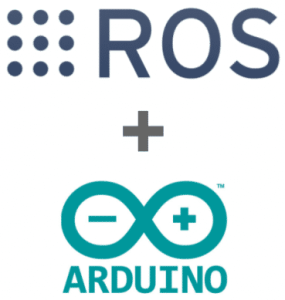

<p align="center"></p>
<h1 align="center"> ROS Arduino </h1> 
<h4 align="right">Jun 23</h4>


<br>


# ROS Arduino IDE Setup 
Para usar las librerías de rosserial en su propio código, primero debe poner
```
#include <ros.h>
#include <std_msgs/String.h>
```
de lo contrario, el IDE de Arduino no podrá localizarlos.

<br>


# Installing the Software on the ROS workstation

```
sudo apt-get install ros-${ROS_DISTRO}-rosserial-arduino
sudo apt-get install ros-${ROS_DISTRO}-rosserial
```

# Install ros_lib into the Arduino Environment
```Los pasos de instalación anterior crearon las bibliotecas necesarias, ahora lo siguiente creará la carpeta ros_lib que el entorno de construcción de Arduino necesita para permitir que los programas de Arduino interactúen con ROS.```

En los pasos a continuación, `sketchbook` es el directorio donde el entorno Linux Arduino guarda sus bocetos. Por lo general, este es un directorio llamado cuaderno de bocetos o Arduino en su directorio de inicio. por ejemplo, cd ~/Arduino/bibliotecas.

Alternativamente, puede instalarlo en un entorno Windows Arduino.

`Las instrucciones de instalación de Ros_lib son diferentes para Groovy Source (catkin) que para versiones anteriores (rosbuild) o binarias.` Asegúrese de haber seleccionado el sistema de compilación correcto arriba para ver las instrucciones apropiadas.

> :warning: **Warning:**debe eliminar las bibliotecas/ros_lib, si están presentes, para poder regenerar, ya que su existencia provoca un error. "rosrun rosserial_arduino make_libraries.py" crea el directorio ros_lib.
```
cd <sketchbook>/libraries
rm -rf ros_lib
rosrun rosserial_arduino make_libraries.py 
```
Si está construyendo Arduino en Windows, debe crear la carpeta ros_lib en algún directorio conveniente.

```
cd <some_empty_directory>
rosrun rosserial_arduino make_libraries.py
```
Si está compilando Arduino en Windows, copie el directorio `ros_lib` de Linux a la carpeta de Windows sketchbook/libraries del sistema Windows (normalmente se encuentra en Mis documentos).

> :warning: **Warning:** actualmente puede instalar las bibliotecas de Arduino directamente en el IDE de Arduino. Simplemente abra el Administrador de bibliotecas desde el menú IDE en Sketch -> Incluir biblioteca -> Administrar biblioteca. Luego busque "rosserial". Esto es útil si necesita trabajar en un boceto de Arduino pero no desea configurar una estación de trabajo ROS completa.

# Terminando
Después de reiniciar su IDE, debería ver ros_lib en la lista de ejemplos:

***imagenes***

<br>

# Hello World: Creating a Publisher
Desde IDE Arduino Examples/Rosserial Arduino library/Hello Wold
```
   1 /*
   2  * rosserial Publisher Example
   3  * Prints "hello world!"
   4  */
   5 
   6 // Use the following line if you have a Leonardo or MKR1000
   7 //#define USE_USBCON
   8 
   9 #include <ros.h>
  10 #include <std_msgs/String.h>
  11 
  12 ros::NodeHandle nh;
  13 
  14 std_msgs::String str_msg;
  15 ros::Publisher chatter("chatter", &str_msg);
  16 
  17 char hello[13] = "hello world!";
  18 
  19 void setup()
  20 {
  21   nh.initNode();
  22   nh.advertise(chatter);
  23 }
  24 
  25 void loop()
  26 {
  27   str_msg.data = hello;
  28   chatter.publish( &str_msg );
  29   nh.spinOnce();
  30   delay(1000);
  31 }
```

El identificador del nodo, lo que permite que nuestro programa cree editores y suscriptores. El controlador de nodo también se ocupa de las comunicaciones del puerto serie.
```
ros::NodeHandle nh;
```

<br>

---
Copyright &copy; 2022 [carjavi](https://github.com/carjavi). <br>
```www.instintodigital.net``` <br>
carjavi@hotmail.com <br>
<p align="center">
    <a href="https://instintodigital.net/" target="_blank"></a>
</p>


